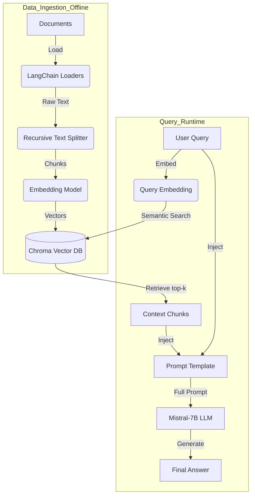

# Comprehensive Project Methodology and Detailed Analysis

## 1. Project Overview & Objective

The objective of this project is to build a **Retrieval-Augmented Generation (RAG)** system capable of answering questions based on a specific corpus of Sanskrit documents. 

**Core Problem Solved:** Standard LLMs (like GPT-4 or Mistral) are trained on vast amounts of internet data but lack knowledge of private or specific documents (e.g., specific Sanskrit manuscripts or local PDFs). This system "augments" the LLM with this specific knowledge without needing to fine-tune the model, which is computationally expensive.

**Key Design Decisions:**
*   **Local Execution**: The entire system runs offline to ensure data privacy and zero cloud cost.
*   **CPU Optimization**: Utilizes `Quantization` (GGUF format) to run a powerful 7-billion parameter model on standard consumer hardware (8GB+ RAM).
*   **Cross-Lingual Capability**: Employs a multilingual embedding model to bridge the gap between English queries and Sanskrit content.

---

## 2. System Architecture

The architecture implements a modular RAG pipeline.



---

## 3. Detailed Step-by-Step Methodology

### Phase 1: Data Ingestion (The "Learning" Phase)
**File:** `code/ingest.py`

This phase transforms raw documents into a searchable mathematical format. It is typically run once or whenever the source data updates.

#### Step 1.1: Document Loading
*   **Operation**: The system traverses the `data/` directory to identify files.
*   **Technical Detail**:
    *   **Abstraction**: We use `LangChain` document loaders (`TextLoader`, `PyPDFLoader`, `Docx2txtLoader`) to abstract away file parsing complexities.
    *   **Normalization**: All text is converted to a standard Python string format, removing file-specific formatting (like PDF headers or DOCX styles).

#### Step 1.2: Text Splitting (Chunking)
*   **Why is this needed?**: 
    1.  **Context Limits**: Mistral-7B has a context window of 2048-4096 tokens. Passing a whole book would overflow this limit.
    2.  **Precision**: Semantic search works better on focused paragraphs than entire chapters.
*   **Algorithm**: `RecursiveCharacterTextSplitter`
    *   **Logic**: It tries to split text by high-level separators (like double newlines `\n\n`) first to keep paragraphs together. If a paragraph is still too big, it tries single newlines `\n`, then spaces, then characters.
    *   **Configuration**:
        *   `chunk_size=500`: Each chunk is roughly 500 characters long (approx. 100-150 words).
        *   `chunk_overlap=50`: A "sliding window" approach. The last 50 chars of Chunk A are the first 50 chars of Chunk B. This prevents splitting a sentence in the middle and losing its meaning.

#### Step 1.3: Embedding Generation
*   **The Brain of Retrieval**: This step converts text into a list of floating-point numbers (a vector).
*   **Model Used**: `sentence-transformers/paraphrase-multilingual-MiniLM-L12-v2`
*   **Deep Dive**: 
    *   This is a BERT-based model tuned for semantic similarity.
    *   **Multilingual**: It maps "Truth" (English) and "Satyam" (Sanskrit) to nearby points in the vector space, enabling cross-language retrieval.
    *   **Dimensionality**: It creates a fixed-size vector (e.g., 384 dimensions) for each text chunk.

#### Step 1.4: Vector Storage (ChromaDB)
*   **Operation**: The vectors and their corresponding text are stored in `data/chroma_db`.
*   **Technology**: Chroma is an embedded vector database. It uses HNSW (Hierarchical Navigable Small World) graphs for efficient Approximate Nearest Neighbor (ANN) search. This allows finding the most similar chunks in milliseconds, even among millions of documents.

---

### Phase 2: RAG Inference (The "Answering" Phase)
**File:** `code/rag_app.py`

This is the live application where the user interacts with the system.

#### Step 2.1: Model & Engine Initialization
*   **Quantization**: We use the `Q4_K_M` GGUF version of Mistral. 
    *   *Explanation*: Standard models use 16-bit (FP16) numbers for weights. Q4 quantization maps these to 4-bit integers. This reduces memory usage by ~75% (from ~14GB to ~4GB) with negligible loss in intelligence.
*   **Engine**: `CTransformers` is a Python binding for `ggml`, a C++ library designed to run tensor operations efficiently on CPUs (Apple Silicon or Intel/AMD).

#### Step 2.2: Semantic Retrieval
*   **Input**: User asks, "What are the duties of a student?"
*   **Query Embedding**: The query is converted to a vector $V_q$ using the *same* Multilingual MiniLM model.
*   **Similarity Search**: The system calculates the **Cosine Similarity** between $V_q$ and all stored chunk vectors $V_{d1}, V_{d2}...$:
    $$ \text{similarity} = \cos(\theta) = \frac{A \cdot B}{\|A\| \|B\|} $$
*   **Selection**: The top $k=3$ chunks with the highest similarity scores are retrieved. These represent the most relevant information in the database.

#### Step 2.3: Prompt Engineering
*   The retrieved chunks ($C_1, C_2, C_3$) are plugged into a strict template. This is crucial for grounding the AI.
*   **Template Logic**:
    ```text
    [Instructions]: You are a helpful assistant. Use ONLY the provided context.
    [Context]: {C1} + {C2} + {C3}
    [Question]: "What are the duties of a student?"
    [Answer]: 
    ```
*   This forces the model to look at the "Context" section before generating the "Answer".

#### Step 2.4: Generative Inference
*   The LLM processes this massive prompt.
*   **Decoding Strategy**:
    *   `temperature=0.1`: This setting makes the model "deterministic". It chooses the most likely next word rather than being creative. This is vital for factual RAG systems to reduce hallucinations.
*   **Output**: The model generates the final response sentence by sentence, which is streamed to the user interface.

---

## 4. Technical Stack & Justification

| Layer | Technology | Justification |
| :--- | :--- | :--- |
| **Frontend** | Streamlit | Rapid prototyping, pure Python, built-in chat UI components. |
| **Orchestration** | LangChain | Standardizes the interface between different LLMs, Vector DBs, and Embeddings. |
| **Vector Store** | ChromaDB | Open-source, no external server required (runs in-process), simple API. |
| **LLM Inference** | CTransformers (GGML) | The standard for running LLaMA/Mistral models on consumer CPUs efficiently. |
| **Embeddings** | HuggingFace (MiniLM) | Best balance of speed/size vs. accuracy for multilingual tasks. |
